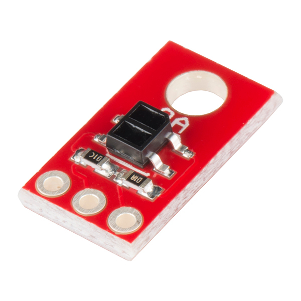

## QRE1113 Library (C/C++)
* Library to use the QRE1113 Line Sensor (Analog).
   
|     |
| :----------------------------: |
| *SparkFun QRE1113 Line Sensor* |
   
## How to use ?   
* Include the library and call the constructor `QRE1113`:
```C++
#include "QRE1113-Arduino.h"
 
QRE1113 lineSensor(A0); //Ex.: Analog Pin A0 on Arduino

void setup()
{
...
}
  
void loop()
{
...
lineSensor.read() // Return the analogic value read by sensor
lineSensor.isRefleting() // Check if a surface is reflecting
...
}
```
